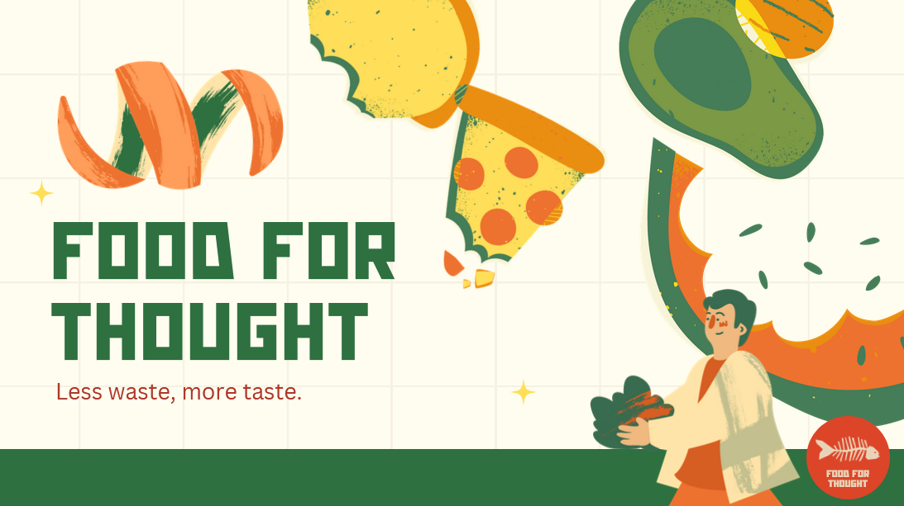
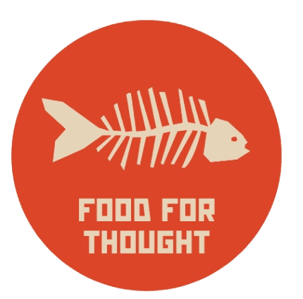
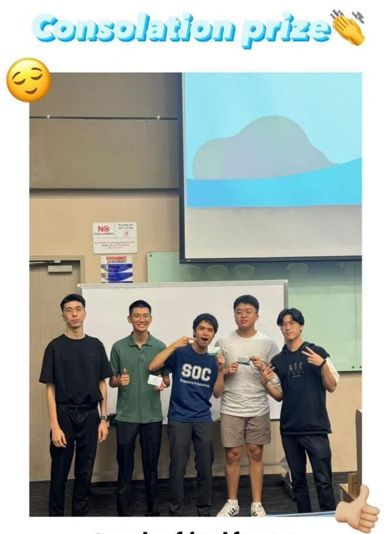
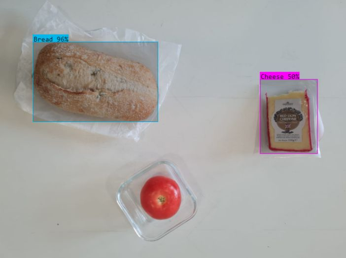
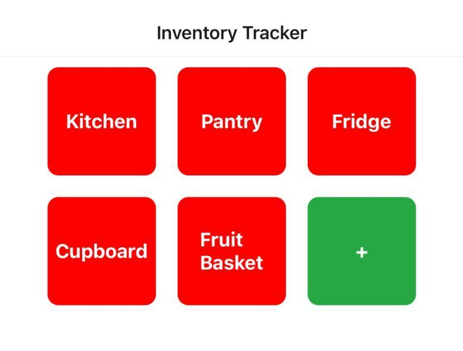
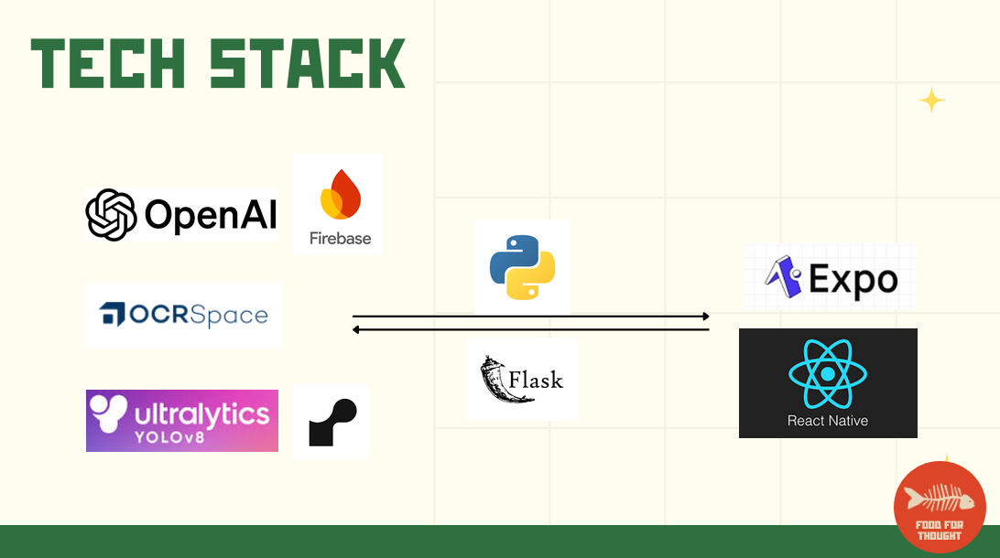

# Food for Thought 🥗

<div align="center">
  
</div>

<h4 align="center">
  <a href="#features">Features</a>
  <span> · </span>
  <a href="#tech-stack">Tech Stack</a>
  <span> · </span>
  <a href="#getting-started">Getting Started</a>
  <span> · </span>
  <a href="https://github.com/GabrielxKuek/FoodForThought/issues">Report Bug</a>
</h4>

---

**Food for Thought** is an innovative mobile application that combines computer vision and inventory management to help users reduce food waste. By leveraging AI technology, the app detects vegetables and suggests recipes to utilize overlooked ingredients, while also tracking inventory through receipt scanning.

<div align="center">
  
</div>

## 🏆 Achievements

Consolation Prize Winner at Tryhack 2024 (Singapore Polytechnic) - 4th Place (tied)

<div align="center">
  
</div>

## ✨ Features

| Feature | Description | Demo |
| ------- | ----------- | ---- |
| **Computer Vision Detection** | Utilizes advanced AI models to identify vegetables and produce in real-time |  |
| **Smart Recipe Suggestions** | Generates recipe recommendations based on detected ingredients to minimize food waste |  |
| **Receipt OCR** | Automatically tracks inventory through optical character recognition of shopping receipts |  |

## 🛠️ Tech Stack

<div align="center">
  
</div>

- Frontend: React Native
- Backend: Flask
- Database: Firebase
- AI/ML: Custom trained computer vision models

## 🚀 Getting Started

### Prerequisites
- Node.js
- Python 3.8+
- Firebase account
- React Native development environment

### Installation
1. Clone the repository
```bash
git clone https://github.com/GabrielxKuek/FoodForThought.git
```

2. Install frontend dependencies
```bash
cd frontend
npm install
```

3. Install backend dependencies
```bash
cd backend
pip install -r requirements.txt
```

4. Set up environment variables following the example in `.env.example`

5. Start the development servers
```bash
# Frontend
npm start

# Backend
python app.py
```

## 👥 Team

- Gabriel Kuek
- Rafael Macam

## 🙏 Acknowledgments

This project was developed for Singapore Polytechnic's Tryhack 2024 Hackathon. As a two-person team, we embraced the challenge of learning new technologies including Flask, Firebase, and AI model training to create an impactful solution for food waste reduction.
